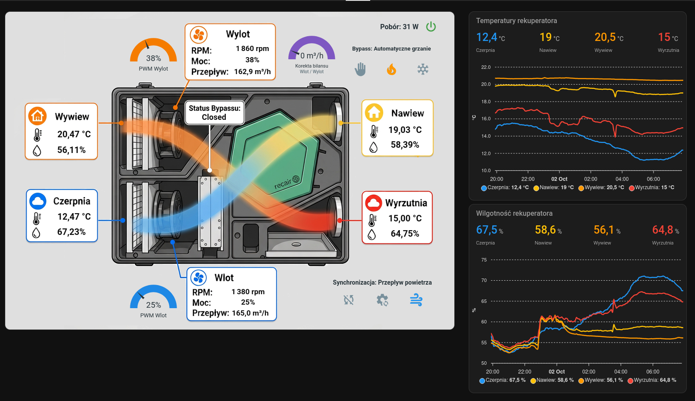

# OpenReku — karta Home Assistant

Karta `picture-elements` z odczytami temperatury i wilgotności, obrotami i przepływem wentylatorów, wskaźnikami PWM oraz sterowaniem bypassem i synchronizacją wentylatorów.

## Pliki

| Plik | Przeznaczenie |
| --- | --- |
| [karta_rekuperator.yaml](karta_rekuperator.yaml) | Konfiguracja karty do wklejenia w edytorze YAML panelu Home Assistant. |
| [test_filtrow.yaml](test_filtrow.yaml) | Automatyzacja uruchamiająca codzienny test filtrów o 03:30. |
| [rekuperator2.jpg](rekuperator2.jpg) | Podkład graficzny karty z ilustracją rekuperatora i polami na odczyty. |

## Przykład

YAML zawiera kartę z ilustracją po lewej stronie. Wykresy temperatur i wilgotności widoczne po prawej są osobnymi kartami panelu.

## Instalacja

1. Dodaj urządzenie ESPHome do Home Assistant, aby udostępnić jego encje.
2. Zainstaluj dodatki [hui-element](https://github.com/thomasloven/lovelace-hui-element) i [Gauge Card Pro](https://github.com/benjamin-dcs/gauge-card-pro), np. przez HACS, zgodnie z ich instrukcjami. Karta używa `custom:hui-element` do osadzania wskaźników `custom:gauge-card-pro` i komunikatu trybu serwisowego.
3. Skopiuj `rekuperator2.jpg` do katalogu `www` konfiguracji Home Assistant, zwykle `/config/www/rekuperator2.jpg`. W YAML odpowiada mu ścieżka `image: /local/rekuperator2.jpg`. Jeśli tworzysz katalog `www` po raz pierwszy, uruchom ponownie Home Assistant. [Opis obsługi plików lokalnych](https://www.home-assistant.io/integrations/http/#hosting-files).
4. W edycji panelu dodaj kartę ręczną i wklej zawartość `karta_rekuperator.yaml`.
5. Dopasuj identyfikatory encji do swojej instalacji. Plik używa nazw z prefiksem `kotlownia_rekuperator_`; mogą się one różnić od nazw utworzonych przez Twoją integrację ESPHome.

## Test filtrów

W edytorze automatyzacji Home Assistant utwórz nową automatyzację i wklej w trybie YAML zawartość [test_filtrow.yaml](test_filtrow.yaml). Godzina `03:30:00` odnosi się do strefy czasowej Home Assistanta.

Automatyzacja wywołuje `esphome.rekuperator_run_filter_test`. Jeśli urządzenie ma inną nazwę, wybierz odpowiadającą mu akcję `run_filter_test`. Procedurę pomiarową wykonuje ESPHome.

## Encje i obsługa

- Temperatury i wilgotności: czerpnia, nawiew, wywiew i wyrzutnia.
- Wentylatory: PWM, RPM i przepływ powietrza dla wlotu i wylotu.
- Synchronizacja: `Brak`, `Moc PWM` lub `Przepływ powietrza`, wraz z korektą bilansu.
- Bypass: stan zaworu oraz wybór `Ręczne sterowanie`, `Automatyczne grzanie` lub `Automatyczne chłodzenie`.
- Zasilanie i tryb serwisowy: po wyłączeniu zasilania karta jest przygaszona, a sterowanie zablokowane poza przyciskiem zasilania. Tryb serwisowy blokuje całą kartę i wyświetla komunikat.

Odczyt „Pobór” korzysta z osobnego licznika energii: `sensor.kotlownia_shellypmminig3_rekuperator_power`. Podmień tę encję na własny pomiar mocy albo usuń odpowiadający jej element `state-label`, jeśli nie używasz licznika.

Układ nakłada odczyty na konkretne miejsca podkładu. Przy zmianie grafiki zachowaj jej proporcje lub dopasuj pozycje `top` i `left` elementów.
