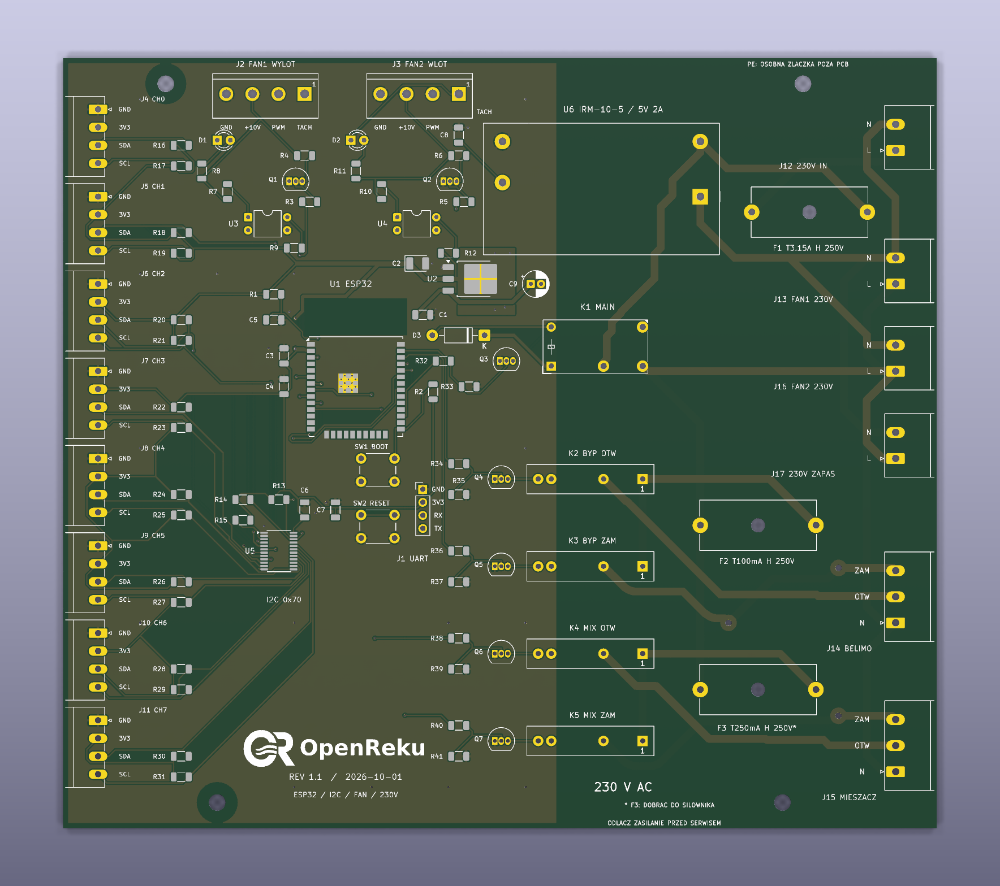

# OpenReku — PCB 1.1

Projekt płytki sterownika rekuperatora OpenReku, rewizja **1.1 z 2026-10-01**. Ten katalog zawiera źródła KiCada, lokalne biblioteki, listę elementów i archiwum produkcyjne PCB. Oprogramowanie ESPHome i pozostałe komponenty projektu należą do osobnych katalogów repozytorium.

## Wizualizacja PCB



Podgląd płytki bez zamontowanych elementów, z widocznymi padami i nadrukiem. Plik PNG służy do szybkiego przeglądania projektu; pliki produkcyjne znajdują się w archiwum Gerber.

## Otwieranie projektu

Otwórz [OpenReku.kicad_pro](OpenReku.kicad_pro) w **KiCad 10**. Pakiet przygotowano i sprawdzono w KiCad 10.0.6. Potrzebne są standardowe biblioteki symboli, footprintów i — do podglądu 3D — modeli KiCad 10.

Zachowaj razem wszystkie pliki z tego katalogu i podkatalog `Rekuperator.pretty`. Tabele bibliotek korzystają z `${KIPRJMOD}`, czyli katalogu otwartego projektu. Historyczna nazwa biblioteki `Rekuperator` jest celowa: odwołują się do niej schemat i PCB. Nie należy zmieniać jej niezależnie od tych odwołań.

## Zawartość katalogu

| Plik lub katalog | Typ i przeznaczenie |
| --- | --- |
| [OpenReku.kicad_pro](OpenReku.kicad_pro) | Projekt KiCad: wspólne ustawienia schematu i PCB, klasy sieci oraz konfiguracja kontroli projektu. Główny plik do otwarcia. |
| [OpenReku.kicad_sch](OpenReku.kicad_sch) | Główny schemat KiCad: mikrokontroler, zasilanie części logicznej, interfejsy wentylatorów i odwołania do arkuszy podrzędnych. |
| [I2C.kicad_sch](I2C.kicad_sch) | Podrzędny arkusz schematu: multiplekser I²C i złącza czujników. Otwieraj w kontekście głównego projektu. |
| [230V.kicad_sch](230V.kicad_sch) | Podrzędny arkusz schematu: zasilanie sieciowe, zabezpieczenia, przekaźniki i wyjścia 230 V. |
| [OpenReku.kicad_pcb](OpenReku.kicad_pcb) | Projekt PCB KiCad: obrys płytki, rozmieszczenie elementów, ścieżki, przelotki, wylewki miedzi i nadruki. |
| [OpenReku.kicad_dru](OpenReku.kicad_dru) | Własne reguły DRC KiCada, w tym wymagane odstępy między częścią sieciową i niskonapięciową. |
| [Rekuperator.kicad_sym](Rekuperator.kicad_sym) | Lokalna biblioteka symboli schematowych KiCad; zawiera symbol przekaźnika SSR G3MB-202P. |
| [sym-lib-table](sym-lib-table) | Tabela bibliotek symboli projektu: rejestruje lokalną bibliotekę `Rekuperator.kicad_sym`. |
| [Rekuperator.pretty/](Rekuperator.pretty/) | Lokalna biblioteka footprintów KiCad. Każdy plik `.kicad_mod` opisuje pola lutownicze, obrysy lub grafikę jednego footprintu. Szczegóły poniżej. |
| [fp-lib-table](fp-lib-table) | Tabela bibliotek footprintów projektu: rejestruje katalog `Rekuperator.pretty`. |
| [BOM.csv](BOM.csv) | Lista elementów wersji 1.1, wyeksportowana z całej hierarchii schematu. Format CSV UTF-8, separator przecinek. |
| [OpenReku-v1.1-Gerber.zip](OpenReku-v1.1-Gerber.zip) | Archiwum do wykonania samej PCB: Gerbery obu warstw miedzi, obu soldermasek, górnego nadruku i obrysu, wiercenia PTH/NPTH oraz opis zadania `.gbrjob`. Nie zawiera plików automatycznego montażu. |
| [OpenReku-PCB.png](OpenReku-PCB.png) | Wizualizacja PCB 1.1 od góry, bez zamontowanych elementów; obraz PNG 1768 × 1568 px. |
| [README.md](README.md) | Ten opis zawartości, rewizji i sposobu korzystania z projektu. |

### Lokalna biblioteka footprintów

Poniższe pliki znajdują się w `Rekuperator.pretty/`:

| Plik `.kicad_mod` | Przeznaczenie |
| --- | --- |
| `ESP32-WROOM-32U_0.3mm_ThermalDrills.kicad_mod` | Footprint modułu ESP32-WROOM-32U z otworami termicznymi 0,3 mm. |
| `KLS2-EDV-5.08-04P-4_Vertical.kicad_mod` | Czteropinowe złącze interfejsu wentylatora, raster 5,08 mm. |
| `Omron_G3MB-202P_SIP4.kicad_mod` | Footprint przekaźnika SSR Omron G3MB-202P. |
| `PhoenixContact_MC_1,5_4-G-3.5_1x04_P3.50mm_Horizontal_Edge.kicad_mod` | Kątowe, czteropinowe złącze I²C, raster 3,50 mm, z obrysem dopasowanym do montażu przy krawędzi. |
| `PhoenixContact_MSTBA_2,5_2-G-5,08_1x02_P5.08mm_Horizontal_Edge.kicad_mod` | Kątowe, dwupinowe złącze 230 V, raster 5,08 mm, montowane przy krawędzi. |
| `PhoenixContact_MSTBA_2,5_3-G-5,08_1x03_P5.08mm_Horizontal_Edge.kicad_mod` | Kątowe, trzypinowe złącze 230 V, raster 5,08 mm, montowane przy krawędzi. |
| `Logo_OpenReku_36mm.kicad_mod` | Logo OR + OpenReku o szerokości 36 mm na górnej warstwie nadruku; nie jest elementem do zakupu. |

## BOM — lista elementów

`BOM.csv` zawiera **47 grup i 93 elementy**. Grupowanie uwzględnia wartość, footprint, numer części oraz pozostałe eksportowane właściwości, dzięki czemu elementy z odmiennymi uwagami montażowymi pozostają osobnymi pozycjami.

| Kolumna | Znaczenie |
| --- | --- |
| `Reference` | Oznaczenia elementów na schemacie i PCB, np. `R1,R2`. |
| `Quantity` | Liczba elementów w grupie. |
| `Value` | Wartość lub nazwa elementu ze schematu. |
| `Footprint` | Identyfikator biblioteki i footprintu KiCad. |
| `MPN` | Numer części producenta, jeżeli uzupełniono go w schemacie. |
| `MatingConnector` | Opis współpracującego wtyku; wtyk nie jest dodatkowo doliczony do `Quantity`. |
| `Pinout` | Opis wyprowadzeń zapisany w schemacie. |
| `AssemblyNote` | Uwagi montażowe, w tym warunki pominięcia rezystorów podciągających. |
| `DNP` | Oznaczenie elementu przewidzianego do pominięcia przy montażu, jeżeli ustawiono je w KiCadzie. |
| `Datasheet` | Odnośnik do dokumentacji części zapisany w schemacie. |

Puste pole oznacza brak informacji w schemacie. BOM nie obejmuje otworów montażowych H1–H4 ani logo LOGO1. Jest listą elementów projektu; współpracujące wtyki, przewody i osprzęt mechaniczny należy zestawić osobno.

Aby odtworzyć BOM, uruchom w tym katalogu:

```sh
kicad-cli sch export bom \
  --output BOM.csv \
  --fields 'Reference,QUANTITY,Value,Footprint,MPN,MatingConnector,Pinout,AssemblyNote,DNP,Datasheet' \
  --labels 'Reference,Quantity,Value,Footprint,MPN,MatingConnector,Pinout,AssemblyNote,DNP,Datasheet' \
  --group-by 'Value,Footprint,MPN,MatingConnector,Pinout,AssemblyNote,DNP,Datasheet' \
  --sort-field Reference \
  --ref-range-delimiter '' \
  OpenReku.kicad_sch
```

## Rewizja 1.1 względem 1.0

- Obrys PCB zmniejszono z 210 × 180 mm do **170 × 150 mm**.
- Rezystory R1–R41 i kondensatory ceramiczne C1/C3/C4/C5/C6/C7/C8 mają obudowy **1206**. C2 pozostaje tantalowy, a C9 przewlekany.
- Złącza I²C J4–J11 przesunięto o 2 mm w stronę krawędzi, zachowując raster 3,50 mm.
- Złącza 230 V J12–J17 zmieniono z rastra 7,62 mm na **5,08 mm**.
- Przeniesiono C5 i zarezerwowano miejsce dla dłuższego modułu ESP-32S 18 × 25,5 mm. Projekt elektryczny nadal wskazuje ESP32-WROOM-32U; zgodność innego modułu wymaga sprawdzenia jego padów i sposobu podłączenia anteny.
- Zmieniono rozmieszczenie i routing oraz dodano logo OR + OpenReku na górnym nadruku.

Źródła i oryginalne Gerbery wykonanej wersji **1.0** pozostają w historii Git, w commicie `764cad7`. Bieżący katalog zawiera wyłącznie rewizję 1.1, więc jej BOM-u i Gerberów nie należy łączyć z projektem 1.0.

## Produkcja i sprawdzenie pakietu

Archiwum `OpenReku-v1.1-Gerber.zip` pochodzi z przygotowanego pakietu rewizji 1.1. Parametry płytki: **2 warstwy, FR-4 1,6 mm, miedź 35 µm / 1 oz, soldermaska obustronna, nadruk na górze**. Po zmianie projektu PCB trzeba ponownie wygenerować pliki produkcyjne; istniejący ZIP nie aktualizuje się automatycznie.

Przy aktualizacji repozytorium 2026-10-01 sprawdzono:

- zgodność źródeł KiCada i zawartości ZIP-a z sumami SHA-256 pakietu 1.1 oraz integralność archiwum;
- DRC ze sprawdzeniem zgodności schemat–PCB: **0 naruszeń, 0 niepołączonych elementów i 0 rozbieżności** przy regułach zapisanych w projekcie;
- ERC: **0 błędów i 33 ostrzeżenia `endpoint_off_grid`** dotyczące końców połączeń poza siatką;
- zgodność oznaczeń, wartości i footprintów wszystkich 93 elementów BOM-u z PCB.

Wyniki te dotyczą plików projektu, nie potwierdzają testów fizycznej płytki 1.1. Reguły DRC zachowują odstępy 8 mm między częścią sieciową i niskonapięciową oraz 3 mm między różnymi sieciami części sieciowej; kontrola programu nie zastępuje sprawdzenia montażu i izolacji gotowego urządzenia.

Pliki lokalnych ustawień `*.kicad_prl`, blokady `*.lck`, autosave, kopie zapasowe i cache footprintów są pomijane przez główny [`.gitignore`](../.gitignore). Nie są potrzebne do odtworzenia projektu.
