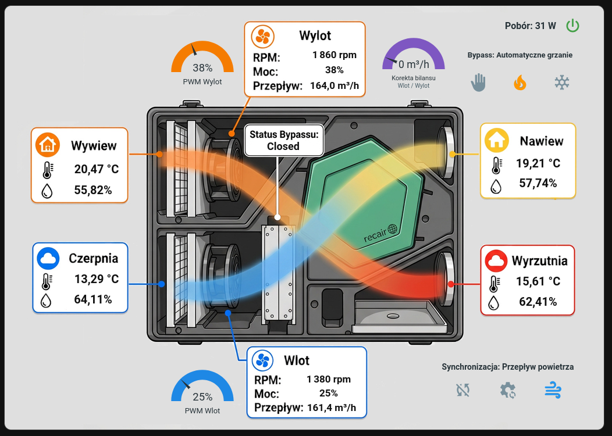

# OpenReku

Otwarty projekt sterownika rekuperatora opartego na ESP32 i ESPHome, współpracującego z Home Assistant. Obejmuje elektronikę sterownika oraz konfigurację obsługującą wentylatory, zawory i czujniki.

## Zawartość repozytorium

| Katalog | Zawartość |
| --- | --- |
| [PCB/](PCB/) | Projekt płytki w wersji 1.1: schematy i PCB KiCad, lokalne biblioteki, lista elementów BOM, Gerbery do produkcji. |
| [PCB/Rekuperator.pretty/](PCB/Rekuperator.pretty/) | Lokalna biblioteka footprintów KiCad: obudowy i pola lutownicze modułu ESP32, złączy i przekaźnika SSR oraz logo OpenReku. |
| [ESPHome/](ESPHome/) | Konfiguracja `rekuperator.yaml` z obsługą urządzenia i integracją z Home Assistant oraz wzór `secrets.yaml.example` do uzupełnienia własnymi danymi dostępowymi. |
| [HomeAssistant/](HomeAssistant/) | Kod YAML karty panelu Home Assistant i instrukcja konfiguracji. |
| [HomeAssistant/automations/](HomeAssistant/automations/) | Automatyzacje testu filtrów i korekty bilansu przy pracy wyciągu kuchennego. |
| [HomeAssistant/www/](HomeAssistant/www/) | Podkład graficzny karty do skopiowania do katalogu `www` Home Assistanta. |

Opis plików i instrukcję otwarcia projektu elektroniki zawiera [PCB/README.md](PCB/README.md). Przygotowanie konfiguracji i pliku sekretów opisano w [ESPHome/README.md](ESPHome/README.md). Sposób dodania karty do panelu opisano w [HomeAssistant/README.md](HomeAssistant/README.md).
